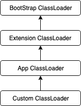
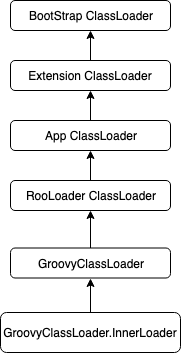

<center><h1>深入理解Groovy Classloader</h1></center>

<h2>java的 classloader</h2>

1. java的classloader是类加载器，作用是加载class文件，生成二进制流到内存中。jvm不需要知道class在哪个地方，是在本地，还是在网络中，jvm并不关心，这些都是由classloader来完成。


2. java的ClassLoader有双亲委派机制，除了bootstrap ClassLoader外，每个classloader都有一个parent的Classloader,当一个classLoader要载入一个类时候，会首先委派给parent，如果parent能载入这个类，则返回，如果不能载入，则自己去加载该class。




<h2>Groovn的ClassLoader</h2>

一个groovy脚本的加载器及其parent是哪些呢？



当需要生成groovy someScript的时候，其实是通过java命令首先去加载GroovyStarter，我们看看源代码的调用过程：

GroovyClassLoader 启动代码如下：

```java
public static void main(String args[]) {
    try {
        rootLoader(args);
    } catch (Throwable t) {
        t.printStackTrace();
    }
}
```

```java
public static void rootLoader(String args[]) {
    String conf = System.getProperty("groovy.starter.conf",null);
    LoaderConfiguration lc = new LoaderConfiguration();
    
    // evaluate parameters
    boolean hadMain=false, hadConf=false, hadCP=false;
    int argsOffset = 0;
    while (args.length-argsOffset>0 && !(hadMain && hadConf && hadCP)) {
        if (args[argsOffset].equals("--classpath")) {
            if (hadCP) break;
            if (args.length==argsOffset+1) {
                exit("classpath parameter needs argument");
            }
            lc.addClassPath(args[argsOffset+1]);
            argsOffset+=2;
            hadCP=true;
        } else if (args[argsOffset].equals("--main")) {
            if (hadMain) break;
            if (args.length==argsOffset+1) {
                exit("main parameter needs argument");
            }
            lc.setMainClass(args[argsOffset+1]);
            argsOffset+=2;
            hadMain=true;
        } else if (args[argsOffset].equals("--conf")) {
            if (hadConf) break;
            if (args.length==argsOffset+1) {
                exit("conf parameter needs argument");
            }
            conf=args[argsOffset+1];
            argsOffset+=2;
            hadConf=true;
        } else {
            break;
        }            
    }

    // this allows to override the commandline conf
    String confOverride = System.getProperty("groovy.starter.conf.override",null);
    if (confOverride!=null) conf = confOverride;

    // we need to know the class we want to start
    if (lc.getMainClass()==null && conf==null) {
        exit("no configuration file or main class specified");
    }
    
    // copy arguments for main class 
    String[] newArgs = new String[args.length-argsOffset];
    for (int i=0; i<newArgs.length; i++) {
        newArgs[i] = args[i+argsOffset];
    }        
    // load configuration file
    if (conf!=null) {
        try {
            lc.configure(new FileInputStream(conf));
        } catch (Exception e) {
            System.err.println("exception while configuring main class loader:");
            exit(e);
        }
    }
    // create loader and execute main class
    ClassLoader loader = new RootLoader(lc);
    Method m=null;
    try {
    //使用RooltLoader加载GroovyMain
        Class c = loader.loadClass(lc.getMainClass());
        m = c.getMethod("main", new Class[]{String[].class});
    } catch (ClassNotFoundException e1) {
        exit(e1);
    } catch (SecurityException e2) {
        exit(e2);
    } catch (NoSuchMethodException e2) {
        exit(e2);
    }
    try {
    //将groovy脚本参数传给GroovyMain
        m.invoke(null, new Object[]{newArgs});
    } catch (IllegalArgumentException e3) {
        exit(e3);
    } catch (IllegalAccessException e3) {
        exit(e3);
    } catch (InvocationTargetException e3) {
        exit(e3);
    } 
}
```

GroovyMain的调用如下：

最终会调用processOnce()方法

```java
/**
 * Process the standard, single script with args.
 */
private void processOnce() throws CompilationFailedException, IOException, URISyntaxException {
    GroovyShell groovy = new GroovyShell(conf);
    setupContextClassLoader(groovy);
    groovy.run(getScriptSource(isScriptFile, script), args);
}
```

GroovyShell的构造方法：

parentLoader是groovyShell的classloader即RootLoader,而GroovyShell使用GroovyClassder来加载goovy脚本。

```java
public GroovyShell(ClassLoader parent, Binding binding, final CompilerConfiguration config) {
    if (binding == null) {
        throw new IllegalArgumentException("Binding must not be null.");
    }
    if (config == null) {
        throw new IllegalArgumentException("Compiler configuration must not be null.");
    }
    final ClassLoader parentLoader = (parent!=null)?parent:GroovyShell.class.getClassLoader();
    this.loader = AccessController.doPrivileged(new PrivilegedAction<GroovyClassLoader>() {
        public GroovyClassLoader run() {
            return new GroovyClassLoader(parentLoader,config);
        }
    });
    this.context = binding;        
    this.config = config;
}
```


<h4>RootLoader</h4>

RootLoader是加载goovy home下的jar包及groovy依赖的三方jar包。为什么不直接将jar包直接放在java的classPath下面呢？实际放在java classPath交给java加载也是可以的。但是groovy为了方便管理，可通过更多灵活的方式给groovy添加classPath,甚至在代码中就可以添加ClassPath。

RootLoader并没有遵循java的双亲委派机制的原因在于，如果交给system classloader去加载的话，当加载groovy类的时候需要用到groovy依赖的第三方jar包，而system classloader并不知道这些jar包在哪里，所以没有遵守双亲委派机制。不过我觉得，全部放在java classpath下面，system classloader也可以加载的；为什么要这样做，还是为了方便管理，双亲委派只是规范而已，是可以打破的。这样做，可以把groovy的加载单独独立出来。

```java
/**
 * loads a class using the name of the class
 */
protected synchronized Class loadClass(final String name, boolean resolve) throws ClassNotFoundException {
    Class c = this.findLoadedClass(name);
    if (c != null) return c;
    c = (Class) customClasses.get(name);
    if (c != null) return c;

    try {
        //先自己尝试加载
        c = oldFindClass(name);
    } catch (ClassNotFoundException cnfe) {
        // IGNORE
    }
    //加载不了就交给parent，详细可以见super.loadClass（），该方法会先交给parent加载，加载不了给自己加载。 因此由此可以看出打破了双亲委派机制
    if (c == null) c = super.loadClass(name, resolve);

    if (resolve) resolveClass(c);

    return c;
}
```


<h4>GroovyClassLoader及GroovyClassLoader.InnerLoader</h4>

GroovyClassLoader主要负责在运行时编译groovy源代码为Class的工作，从而使Groovy实现了将groovy源代码动态加载为Class的功能。GroovyClassLoader加载的时候实际是交给GroovyClassLoader.InnerLoader来完成了，每次加载都会创建一个InnerLoader实例。

GroovyClassLoader编译groovy代码的工作重要集中到parse方法中： 

```java
/**
 * Parses the given text into a Java class capable of being run
 *
 * @param text the text of the script/class to parse
 * @return the main class defined in the given script
 */
public Class parseClass(String text) throws CompilationFailedException {
    //如果传过来的是脚本字符串，那脚本名称跟时间戳相关
    return parseClass(text, "script" + System.currentTimeMillis() +
            Math.abs(text.hashCode()) + ".groovy");
}
```

```java
/**
 * Parses the given code source into a Java class. If there is a class file
 * for the given code source, then no parsing is done, instead the cached class is returned.
 *
 * @param shouldCacheSource if true then the generated class will be stored in the source cache
 * @return the main class defined in the given script
 */
public Class parseClass(GroovyCodeSource codeSource, boolean shouldCacheSource) throws CompilationFailedException {
    synchronized (sourceCache) {
        Class answer = sourceCache.get(codeSource.getName());
        if (answer != null) return answer;
        answer = doParseClass(codeSource);
        //解析完后，每次都会缓存该Class，如果多次编译相同字符串，这里是有问题的，会出现MetaSpace爆满。
        if (shouldCacheSource) sourceCache.put(codeSource.getName(), answer);
        return answer;
    }
}
```

```java
private Class doParseClass(GroovyCodeSource codeSource) {
    validate(codeSource);
    Class answer;  // Was neither already loaded nor compiling, so compile and add to cache.
    CompilationUnit unit = createCompilationUnit(config, codeSource.getCodeSource());
    if (recompile!=null && recompile || recompile==null && config.getRecompileGroovySource()) {
        unit.addFirstPhaseOperation(TimestampAdder.INSTANCE, CompilePhase.CLASS_GENERATION.getPhaseNumber());
    }
    SourceUnit su = null;
    File file = codeSource.getFile();
    if (file != null) {
        su = unit.addSource(file);
    } else {
        URL url = codeSource.getURL();
        if (url != null) {
            su = unit.addSource(url);
        } else {
            su = unit.addSource(codeSource.getName(), codeSource.getScriptText());
        }
    }
//每次编译groovy脚本的时候都会创建GroovyClassLoader.InnerLoader
    ClassCollector collector = createCollector(unit, su);
    unit.setClassgenCallback(collector);
    int goalPhase = Phases.CLASS_GENERATION;
    if (config != null && config.getTargetDirectory() != null) goalPhase = Phases.OUTPUT;
    unit.compile(goalPhase);

    answer = collector.generatedClass;
    String mainClass = su.getAST().getMainClassName();
    for (Object o : collector.getLoadedClasses()) {
        Class clazz = (Class) o;
        String clazzName = clazz.getName();
        definePackage(clazzName);
        setClassCacheEntry(clazz);
        if (clazzName.equals(mainClass)) answer = clazz;
    }
    return answer;
}
```

```java
/**
 * creates a ClassCollector for a new compilation.
 *
 * @param unit the compilationUnit
 * @param su   the SourceUnit
 * @return the ClassCollector
 */
protected ClassCollector createCollector(CompilationUnit unit, SourceUnit su) {
    InnerLoader loader = AccessController.doPrivileged(new PrivilegedAction<InnerLoader>() {
        public InnerLoader run() {
            return new InnerLoader(GroovyClassLoader.this);
        }
    });
    return new ClassCollector(loader, unit, su);
}
```


GroovyClassLoader.InnerLoader:

```java
public Class loadClass(String name, boolean lookupScriptFiles, boolean preferClassOverScript, boolean resolve) throws ClassNotFoundException, CompilationFailedException {
    Class c = findLoadedClass(name);
    if (c != null) return c;
    return delegate.loadClass(name, lookupScriptFiles, preferClassOverScript, resolve);
}

public Class parseClass(GroovyCodeSource codeSource, boolean shouldCache) throws CompilationFailedException {
    return delegate.parseClass(codeSource, shouldCache);
}
```

InnerLoader加载其实还是交给GroovyClassLoader去加载的，不过每一次编译脚本都会生成一个InnerLoader.这样做的目的是：

- 由于一个ClassLoader对于同一个名字的类只能加载一次，如果都由GroovyClassLoader加载，那么当一个脚本里定义了C这个类之后，另外一个脚本再定义一个C类的话，GroovyClassLoader就无法加载了。
- 由于当一个类的ClassLoader被GC之后，这个类才能被GC，如果由GroovyClassLoader加载所有的类，那么只有当GroovyClassLoader被GC了，所有这些类才能被GC，而如果用InnerLoader的话，由于编译完源代码之后，已经没有对它的外部引用，除了它加载的类，所以只要它加载的类没有被引用之后，它以及它加载的类就都可以被GC了。


<h4>总结</h4>

本文介绍了Groovy中最主要的3个ClassLoader： 

- RootLoader：管理了Groovy的classpath，负责加载Groovy及其依赖的第三方库中的类，它不是使用双亲委派模型。
- GroovyClassLoader：负责在运行时编译groovy源代码为Class的工作，从而使Groovy实现了将groovy源代码动态加载为Class的功能。
- GroovyClassLoader.InnerLoader：Groovy脚本类的直接ClassLoader，它将加载工作委派给GroovyClassLoader，它的存在是为了支持不同源码里使用相同的类名，以及加载的类能顺利被GC。


<h5>注意</h5>

<p>如果交给GroovyClassLoader编译的是脚本文本串，多次编译相同文本串都会生成Class,类名会以"script" + System.currentTimeMillis() 来命名，这里如果处理不当，生成太多这种类，会撑爆MetaSpace，造成不断full gc。</p>

