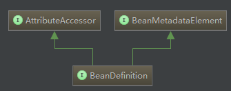
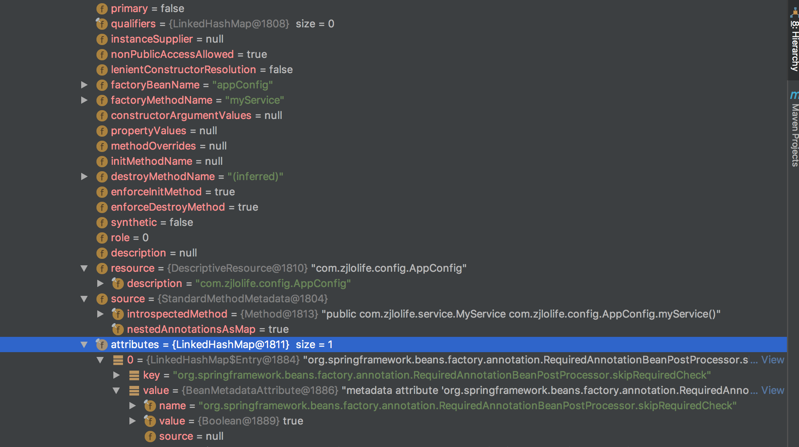
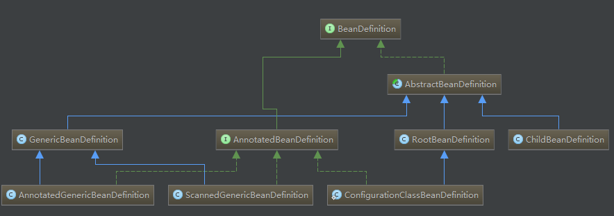
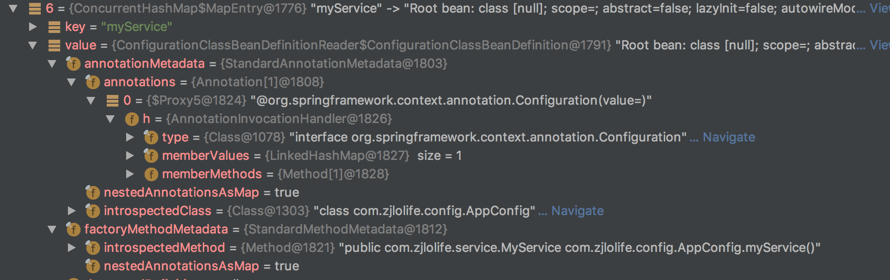

来一张类图看看：

BeanDefinition继承AttributeAccessor和BeanMetadataElement。




AttributeAccessor代码如下：

该接口主要是定义对对象的元数据的增加，删除，获取等操作。所谓元数据就是描述对象的，比如一个人，有性别，年龄，学历，等这些都是元数据。这里不是指的对象的属性，具体见下图



```
/**
 * Interface defining a generic contract for attaching and accessing metadata
 * to/from arbitrary objects.
 *
 * @author Rob Harrop
 * @since 2.0
 */
public interface AttributeAccessor {

   /**
    * Set the attribute defined by {@code name} to the supplied   {@code value}.
    * If {@code value} is {@code null}, the attribute is {@link #removeAttribute removed}.
    * <p>In general, users should take care to prevent overlaps with other
    * metadata attributes by using fully-qualified names, perhaps using
    * class or package names as prefix.
    * @param name the unique attribute key
    * @param value the attribute value to be attached
    */
   void setAttribute(String name, @Nullable Object value);

   /**
    * Get the value of the attribute identified by {@code name}.
    * Return {@code null} if the attribute doesn't exist.
    * @param name the unique attribute key
    * @return the current value of the attribute, if any
    */
   @Nullable
   Object getAttribute(String name);

   /**
    * Remove the attribute identified by {@code name} and return its value.
    * Return {@code null} if no attribute under {@code name} is found.
    * @param name the unique attribute key
    * @return the last value of the attribute, if any
    */
   @Nullable
   Object removeAttribute(String name);

   /**
    * Return {@code true} if the attribute identified by {@code name} exists.
    * Otherwise return {@code false}.
    * @param name the unique attribute key
    */
   boolean hasAttribute(String name);

   /**
    * Return the names of all attributes.
    */
   String[] attributeNames();

}
```

BeanMetadataElement:主要是用来获取配置源的对象.

见上图中的source字段StandardMethodMetadata

```
/**
 * Interface to be implemented by bean metadata elements
 * that carry a configuration source object.
 *
 * @author Juergen Hoeller
 * @since 2.0
 */
public interface BeanMetadataElement {

   /**
    * Return the configuration source {@code Object} for this metadata element
    * (may be {@code null}).
    */
   @Nullable
   Object getSource();

}
```

下面看看BeanDefinition类图：



来看看BeanDefinition定义：

```
/**
 * A BeanDefinition describes a bean instance, which has property values,
 * constructor argument values, and further information supplied by
 * concrete implementations.
 *
 * <p>This is just a minimal interface: The main intention is to allow a
 * {@link BeanFactoryPostProcessor} such as {@link PropertyPlaceholderConfigurer}
 * to introspect and modify property values and other bean metadata.
 *
 * @author Juergen Hoeller
 * @author Rob Harrop
 * @since 19.03.2004
 * @see ConfigurableListableBeanFactory#getBeanDefinition
 * @see org.springframework.beans.factory.support.RootBeanDefinition
 * @see org.springframework.beans.factory.support.ChildBeanDefinition
 */
public interface BeanDefinition extends AttributeAccessor, BeanMetadataElement {

   /**
    * Scope identifier for the standard singleton scope: "singleton".
    * <p>Note that extended bean factories might support further scopes.
    * @see #setScope
    */
   String SCOPE_SINGLETON = ConfigurableBeanFactory.SCOPE_SINGLETON;

   /**
    * Scope identifier for the standard prototype scope: "prototype".
    * <p>Note that extended bean factories might support further scopes.
    * @see #setScope
    */
   String SCOPE_PROTOTYPE = ConfigurableBeanFactory.SCOPE_PROTOTYPE;


   /**
    * Role hint indicating that a {@code BeanDefinition} is a major part
    * of the application. Typically corresponds to a user-defined bean.
    */
    //用户定义
   int ROLE_APPLICATION = 0;

   /**
    * Role hint indicating that a {@code BeanDefinition} is a supporting
    * part of some larger configuration, typically an outer
    * {@link org.springframework.beans.factory.parsing.ComponentDefinition}.
    * {@code SUPPORT} beans are considered important enough to be aware
    * of when looking more closely at a particular
    * {@link org.springframework.beans.factory.parsing.ComponentDefinition},
    * but not when looking at the overall configuration of an application.
    */
    
   int ROLE_SUPPORT = 1;

   /**
    * Role hint indicating that a {@code BeanDefinition} is providing an
    * entirely background role and has no relevance to the end-user. This hint is
    * used when registering beans that are completely part of the internal workings
    * of a {@link org.springframework.beans.factory.parsing.ComponentDefinition}.
    */
   int ROLE_INFRASTRUCTURE = 2;


   // Modifiable attributes

   /**
    * Set the name of the parent definition of this bean definition, if any.
    */
   void setParentName(@Nullable String parentName);

   /**
    * Return the name of the parent definition of this bean definition, if any.
    */
   @Nullable
   String getParentName();

   /**
    * Specify the bean class name of this bean definition.
    * <p>The class name can be modified during bean factory post-processing,
    * typically replacing the original class name with a parsed variant of it.
    * @see #setParentName
    * @see #setFactoryBeanName
    * @see #setFactoryMethodName
    */
   void setBeanClassName(@Nullable String beanClassName);

   /**
    * Return the current bean class name of this bean definition.
    * <p>Note that this does not have to be the actual class name used at runtime, in
    * case of a child definition overriding/inheriting the class name from its parent.
    * Also, this may just be the class that a factory method is called on, or it may
    * even be empty in case of a factory bean reference that a method is called on.
    * Hence, do <i>not</i> consider this to be the definitive bean type at runtime but
    * rather only use it for parsing purposes at the individual bean definition level.
    * @see #getParentName()
    * @see #getFactoryBeanName()
    * @see #getFactoryMethodName()
    */
   @Nullable
   String getBeanClassName();

   /**
    * Override the target scope of this bean, specifying a new scope name.
    * @see #SCOPE_SINGLETON
    * @see #SCOPE_PROTOTYPE
    */
   void setScope(@Nullable String scope);

   /**
    * Return the name of the current target scope for this bean,
    * or {@code null} if not known yet.
    */
   @Nullable
   String getScope();

   /**
    * Set whether this bean should be lazily initialized.
    * <p>If {@code false}, the bean will get instantiated on startup by bean
    * factories that perform eager initialization of singletons.
    */
   void setLazyInit(boolean lazyInit);

   /**
    * Return whether this bean should be lazily initialized, i.e. not
    * eagerly instantiated on startup. Only applicable to a singleton bean.
    */
   boolean isLazyInit();

   /**
    * Set the names of the beans that this bean depends on being initialized.
    * The bean factory will guarantee that these beans get initialized first.
    */
   void setDependsOn(@Nullable String... dependsOn);

   /**
    * Return the bean names that this bean depends on.
    */
   @Nullable
   String[] getDependsOn();

   /**
    * Set whether this bean is a candidate for getting autowired into some other bean.
    * <p>Note that this flag is designed to only affect type-based autowiring.
    * It does not affect explicit references by name, which will get resolved even
    * if the specified bean is not marked as an autowire candidate. As a consequence,
    * autowiring by name will nevertheless inject a bean if the name matches.
    */
   void setAutowireCandidate(boolean autowireCandidate);

   /**
    * Return whether this bean is a candidate for getting autowired into some other bean.
    */
   boolean isAutowireCandidate();

   /**
    * Set whether this bean is a primary autowire candidate.
    * <p>If this value is {@code true} for exactly one bean among multiple
    * matching candidates, it will serve as a tie-breaker.
    */
   void setPrimary(boolean primary);

   /**
    * Return whether this bean is a primary autowire candidate.
    */
   boolean isPrimary();

   /**
    * Specify the factory bean to use, if any.
    * This the name of the bean to call the specified factory method on.
    * @see #setFactoryMethodName
    */
   void setFactoryBeanName(@Nullable String factoryBeanName);

   /**
    * Return the factory bean name, if any.
    */
   @Nullable
   String getFactoryBeanName();

   /**
    * Specify a factory method, if any. This method will be invoked with
    * constructor arguments, or with no arguments if none are specified.
    * The method will be invoked on the specified factory bean, if any,
    * or otherwise as a static method on the local bean class.
    * @see #setFactoryBeanName
    * @see #setBeanClassName
    */
   void setFactoryMethodName(@Nullable String factoryMethodName);

   /**
    * Return a factory method, if any.
    */
   @Nullable
   String getFactoryMethodName();

   /**
    * Return the constructor argument values for this bean.
    * <p>The returned instance can be modified during bean factory post-processing.
    * @return the ConstructorArgumentValues object (never {@code null})
    */
   ConstructorArgumentValues getConstructorArgumentValues();

   /**
    * Return if there are constructor argument values defined for this bean.
    * @since 5.0.2
    */
   default boolean hasConstructorArgumentValues() {
      return !getConstructorArgumentValues().isEmpty();
   }

   /**
    * Return the property values to be applied to a new instance of the bean.
    * <p>The returned instance can be modified during bean factory post-processing.
    * @return the MutablePropertyValues object (never {@code null})
    */
   MutablePropertyValues getPropertyValues();

   /**
    * Return if there are property values values defined for this bean.
    * @since 5.0.2
    */
   default boolean hasPropertyValues() {
      return !getPropertyValues().isEmpty();
   }


   // Read-only attributes

   /**
    * Return whether this a <b>Singleton</b>, with a single, shared instance
    * returned on all calls.
    * @see #SCOPE_SINGLETON
    */
   boolean isSingleton();

   /**
    * Return whether this a <b>Prototype</b>, with an independent instance
    * returned for each call.
    * @since 3.0
    * @see #SCOPE_PROTOTYPE
    */
   boolean isPrototype();

   /**
    * Return whether this bean is "abstract", that is, not meant to be instantiated.
    */
   boolean isAbstract();

   /**
    * Get the role hint for this {@code BeanDefinition}. The role hint
    * provides the frameworks as well as tools with an indication of
    * the role and importance of a particular {@code BeanDefinition}.
    * @see #ROLE_APPLICATION
    * @see #ROLE_SUPPORT
    * @see #ROLE_INFRASTRUCTURE
    */
   int getRole();

   /**
    * Return a human-readable description of this bean definition.
    */
   @Nullable
   String getDescription();

   /**
    * Return a description of the resource that this bean definition
    * came from (for the purpose of showing context in case of errors).
    */
   @Nullable
   String getResourceDescription();

   /**
    * Return the originating BeanDefinition, or {@code null} if none.
    * Allows for retrieving the decorated bean definition, if any.
    * <p>Note that this method returns the immediate originator. Iterate through the
    * originator chain to find the original BeanDefinition as defined by the user.
    */
   @Nullable
   BeanDefinition getOriginatingBeanDefinition();

}
```

AnnotatedBeanDefinition主要是暴露出AnnotationMetadata

```
/**
 * Extended {@link org.springframework.beans.factory.config.BeanDefinition}
 * interface that exposes {@link org.springframework.core.type.AnnotationMetadata}
 * about its bean class - without requiring the class to be loaded yet.
 *
 * @author Juergen Hoeller
 * @since 2.5
 * @see AnnotatedGenericBeanDefinition
 * @see org.springframework.core.type.AnnotationMetadata
 */
public interface AnnotatedBeanDefinition extends BeanDefinition {

   /**
    * Obtain the annotation metadata (as well as basic class metadata)
    * for this bean definition's bean class.
    * @return the annotation metadata object (never {@code null})
    */
   AnnotationMetadata getMetadata();

   /**
    * Obtain metadata for this bean definition's factory method, if any.
    * @return the factory method metadata, or {@code null} if none
    * @since 4.1.1
    */
   @Nullable
   MethodMetadata getFactoryMethodMetadata();

}
```



getFactoryMethodMetadata指的就是在appConfig中定义的@Bean的方法

getMetadata指的是配置的注解

AbstractBeanDefinition继承BeanMetadataAttributeAccessor，BeanMetadataAttributeAccessor主要是实现AttributeAccessor和BeanMetadataElement对应的方法。

```
@SuppressWarnings("serial")
public abstract class AbstractBeanDefinition extends BeanMetadataAttributeAccessor
      implements BeanDefinition, Cloneable {
      .....
}
```

GenericBeanDefinition是一站式的标准bean definition，除了具有指定类、可选的构造参数值和属性参数这些其它bean definition一样的特性外，它还具有通过parenetName属性来灵活设置parent bean definition


BeanDefinition继承AttributeAccessor, BeanMetadataElement ，AttributeAccessor：主要是设置BeanDefinition的属性和值，BeanMetadataElement是提供接口返回定义BeanDefinition的source对象


BeanDefinition用MutablePropertyValues表示属性值:

```
/**
 * Return the property values to be applied to a new instance of the bean.
 * <p>The returned instance can be modified during bean factory post-processing.
 * @return the MutablePropertyValues object (never {@code null})
 */
MutablePropertyValues getPropertyValues();
```


PropertyValue这个类中的value属性会经过BeanWrapper转换成对应类型的value值

```
public class PropertyValue extends BeanMetadataAttributeAccessor implements Serializable {

   private final String name;

   @Nullable
   private final Object value;

   private boolean optional = false;

   private boolean converted = false;

   @Nullable
   private Object convertedValue;

   /** Package-visible field that indicates whether conversion is necessary */
   @Nullable
   volatile Boolean conversionNecessary;

   /** Package-visible field for caching the resolved property path tokens */
   @Nullable
   transient volatile Object resolvedTokens;
```

