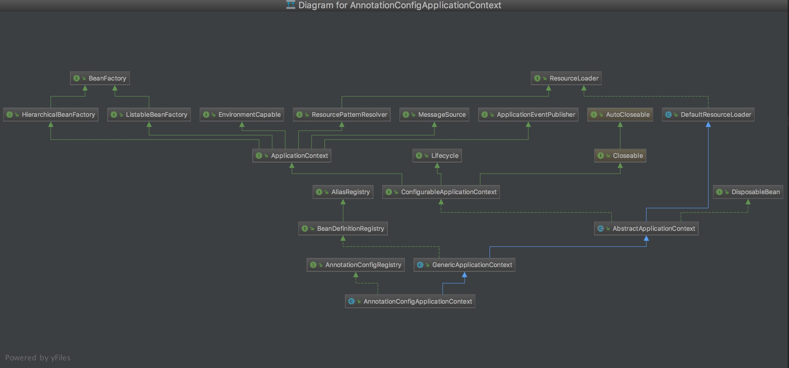

## spring AnnotationConfigApplicationContext源码分析

用法举例：

```
public static void main(String[] args) {
    AnnotationConfigApplicationContext ctx = new AnnotationConfigApplicationContext();
    ctx.register(AppConfig.class, OtherConfig.class);
    ctx.register(AdditionalConfig.class);
    ctx.refresh();
    MyService myService = ctx.getBean(MyService.class);
    myService.doStuff();
}
```

```
public static void main(String[] args) {
    AnnotationConfigApplicationContext ctx = new AnnotationConfigApplicationContext();
    ctx.scan("com.acme");
    ctx.refresh();
    MyService myService = ctx.getBean(MyService.class);
}
```


初始化方法如下

```
public class AnnotationConfigApplicationContext extends GenericApplicationContext implements AnnotationConfigRegistry {

   private final AnnotatedBeanDefinitionReader reader;

   private final ClassPathBeanDefinitionScanner scanner;


   /**
    * Create a new AnnotationConfigApplicationContext that needs to be populated
    * through {@link #register} calls and then manually {@linkplain #refresh refreshed}.
    */
    /**
     * AnnotatedBeanDefinitionReader用来register带有@Configuration的类
     * ClassPathBeanDefinitionScanner用来扫描包的,详细可见registerDefaultFilters方法
     */
   public AnnotationConfigApplicationContext() {
      //初始化时会将几个rootBeanDefinition放进beanFactory中
      this.reader = new AnnotatedBeanDefinitionReader(this);
      this.scanner = new ClassPathBeanDefinitionScanner(this);
   }
```

通过AnnotatedBeanDefinitionReader或ClassPathBeanDefinitionScanner可将BeanDefinition保存在context中的beanFactory中即BeanDefinitionRegistry。此处可见委托模式，通过组合beanFactory实现BeanDefinitionRegistry的方法。

```
public void refresh() throws BeansException, IllegalStateException {
   synchronized (this.startupShutdownMonitor) {
      // Prepare this context for refreshing.
      prepareRefresh();

      //其实创建该context的时候就已经通过调用父类构造方法来完成DefaultListableBeanFactory的创建
      ConfigurableListableBeanFactory beanFactory = obtainFreshBeanFactory();

      //该方法主要是配置DefaultListableBeanFactory如classloader，post-processors，ignoreDependencyInterface等
      prepareBeanFactory(beanFactory);

      try {
         // Allows post-processing of the bean factory in context subclasses.
         //主要是配置register配置类,scan包的
         postProcessBeanFactory(beanFactory);

         //BeanFactoryPostProcessor对BeanFactory进行额外处理，BeanFactoryPostProcessors是在spring boot启动时候提前set进去的可参考SpringApplicationRunListeners。
         invokeBeanFactoryPostProcessors(beanFactory);

         //配置BeanPostProcessor即：beanFactory.addBeanPostProcessor，添加BeanPostProcessors用于bean的额外处理如进行一些初始化等
         registerBeanPostProcessors(beanFactory);

         // Initialize message source for this context.
         initMessageSource();

         // Initialize event multicaster for this context.
         initApplicationEventMulticaster();

         // Initialize other special beans in specific context subclasses.
         onRefresh();

         // Check for listener beans and register them.
         registerListeners();

         // 预先初始化no-lazy的bean
         finishBeanFactoryInitialization(beanFactory);

         // Last step: publish corresponding event.
         finishRefresh();
      }

      catch (BeansException ex) {
         if (logger.isWarnEnabled()) {
            logger.warn("Exception encountered during context initialization - " +
                  "cancelling refresh attempt: " + ex);
         }

         // Destroy already created singletons to avoid dangling resources.
         destroyBeans();

         // Reset 'active' flag.
         cancelRefresh(ex);

         // Propagate exception to caller.
         throw ex;
      }

      finally {
         // Reset common introspection caches in Spring's core, since we
         // might not ever need metadata for singleton beans anymore...
         resetCommonCaches();
      }
   }
}
```

以上是AnnotationConfigApplicationContext初始化过程。下面看看源码设计

UML类图:

​     


1. AnnotationConfigApplicationContext实现AnnotationConfigRegistry接口和继承GenericApplicationContext ，AnnotationConfigApplicationContext相对于GenericApplicationContext而已就是通过reader去读取配置而已。


2. AnnotationConfigRegistry接口

```
public interface AnnotationConfigRegistry {

   /**
    * Register one or more annotated classes to be processed.
    * <p>Calls to {@code register} are idempotent; adding the same
    * annotated class more than once has no additional effect.
    * @param annotatedClasses one or more annotated classes,
    * e.g. {@link Configuration @Configuration} classes
    */
   void register(Class<?>... annotatedClasses);

   /**
    * Perform a scan within the specified base packages.
    * @param basePackages the packages to check for annotated classes
    */
   void scan(String... basePackages);

}
```

上面两个接口AnnotationConfigApplicationContext是通过委托AnnotatedBeanDefinitionReader和ClassPathBeanDefinitionScanner来实现的。

3. BeanDefinitionRegistry接口：主要是用于注册和获取BeanDefinition


4. ApplicationContext接口继承EnvironmentCapable, ListableBeanFactory, HierarchicalBeanFactory,      MessageSource, ApplicationEventPublisher, ResourcePatternResolver等接口

   4.1 EnvironmentCapable用于获取Environment

   4.2 ListableBeanFactory接口：提供一些方法根据某些条件如（有某注解的bean，判断bean是否存在）列举bean

   4.3 HierarchicalBeanFactory 用处暂时不是很理解

   4.4 MessageSource 用于处理资源国际化的，暂时放一放

   4.5 ApplicationEventPublisher 用于ApplicationListeners接收到applicationEvent事件，如何使用applicationEvent之后再分析吧

   4.6 ResourcePatternResolver 解析Resource，后面再单独整理Resource单独接口

5. ConfigurableApplicationContext接口主要用于配置context，如addBeanFactoryPostProcessor，addApplicationListener，及获取getEnvironment，getBeanFactory，注册registerShutdownHook关闭钩子。

6. AbstractApplicationContext 则实现ConfigurableApplicationContext，继承DefaultResourceLoader以实现相关resource 功能。


