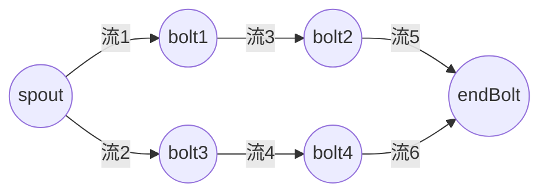

 strom里面有三个重要的概念：topology, spout, bolt, tuple, 流分组。

1. topology 是一个有向无环图。


   topology是有一系列spout, bolt组合而成，spout bolt之间传递单元是tuple。spout只负责监听数据源，bolt可以完成输入流的接收及发射出新的元组形成输出流。spout和bolt都是组件，真正执行的是各个组件的task实例。


流分组：

1. 随机分组（Shuffle grouping）每个bolt实例接收到相同的数量的tuple
2. 字段分组 （Fields grouping）不同值或集中到同一个task上
3. 全局分组  (global grouping)  会分发到task id最小的那个去。
4. 本地或随机分组 (local or shuffle grouping) 
5. 指向分组 direct  grouping （分发到指定的task上）


简单案例

1. github提交次数计数

   1.1 topology拓扑

   ```java
   public static void main(String[] args) {
     TopologyBuilder builder = new TopologyBuilder();
   
     
     //spout
     builder.setSpout("commit-feed-listener", new CommitFeedListener());
   
     
     //email提取bolt  随机分组
     builder
         .setBolt("email-extractor", new EmailExtractor())
         .shuffleGrouping("commit-feed-listener");
     
     //email counter bolt  按字段分组接收emial tuple
     builder
         .setBolt("email-counter", new EmailCounter())
         .fieldsGrouping("email-extractor", new Fields("email"));
   
     Config config = new Config();
     config.setDebug(true);
     StormTopology topology = builder.createTopology();
   
     //本地模式
     LocalCluster cluster = new LocalCluster();
     cluster.submitTopology("github-commit-count-topology",
         config,
         topology);
   
     Utils.sleep(TEN_MINUTES);
     cluster.killTopology("github-commit-count-topology");
     cluster.shutdown();
   ```

   1.2  spuout获取数据源

   ```java
   public class CommitFeedListener extends BaseRichSpout {
     private SpoutOutputCollector outputCollector;
     private List<String> commits;
   
     @Override
     public void declareOutputFields(OutputFieldsDeclarer outputFieldsDeclarer) {
       outputFieldsDeclarer.declare(new Fields("commit"));
     }
   
     @Override
     public void open(Map map,
                      TopologyContext context,
                      SpoutOutputCollector outputCollector) {
       this.outputCollector = outputCollector;
   
       try {
         commits = IOUtils.readLines(ClassLoader.getSystemResourceAsStream("changelog.txt"),
                                     Charset.defaultCharset().name());
       } catch (IOException e) {
         throw new RuntimeException(e);
       }
     }
   
     @Override
     public void nextTuple() {
       for (String commit : commits) {
         outputCollector.emit(new Values(commit));
       }
     }
   }
   ```

   1.3 bolt提取email数据

   ```java
   public class EmailExtractor extends BaseBasicBolt {
     @Override
     public void declareOutputFields(OutputFieldsDeclarer declarer) {
       declarer.declare(new Fields("email"));
     }
   
     @Override
     public void execute(Tuple tuple,
                         BasicOutputCollector outputCollector) {
       String commit = tuple.getStringByField("commit");
       String[] parts = commit.split(" ");
       outputCollector.emit(new Values(parts[1]));
     }
   }
   ```

   1.4 bolt计算email数量

   ```java
   public class EmailCounter extends BaseBasicBolt {
     private Map<String, Integer> counts;
   
     @Override
     public void declareOutputFields(OutputFieldsDeclarer declarer) {
       // This bolt does not emit any values and therefore does not define any output fields.
     }
   
     @Override
     public void prepare(Map stormConf,
                         TopologyContext context) {
       counts = new HashMap<String, Integer>();
     }
   
     @Override
     public void execute(Tuple tuple,
                         BasicOutputCollector outputCollector) {
       String email = tuple.getStringByField("email");
       counts.put(email, countFor(email) + 1);
       printCounts();
     }
   
     private Integer countFor(String email) {
       Integer count = counts.get(email);
       return count == null ? 0 : count;
     }
   
     /**
      * Print the counts to System.out so you can easily see what's happening.
      */
     private void printCounts() {
       for (String email : counts.keySet()) {
         System.out.println(String.format("%s has count of %s", email, counts.get(email)));
       }
     }
   }
   ```
