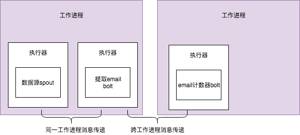

## 1. storm集群相关

strom集群包含两种类型的结点：主节点(master) 和 工作(worker)节点。一个主结点将运行一个，称为Nimbus的守护进程，每个工作结点都将运行程序称为Supervisor的守护进程。

如下图是storm集群

1. 集群有一个主结点，主结点上有一个Nimbus守护进程，用于发布代码，将任务指派给工作结点，监控异常状态，并执行storm UI。Nimbus上能执行storm命令active,deactive,rebalance及kill命令。

2. 集群中有多个工作结点，可分布在不同的物理机器或者虚拟机器。每个工作结点都将在后台运行一个守护进程Supervisor,每个Supervisor通过监听Nimbus分配到工作结点上的任务去启动或结束工作进程。工作进程上是spout和bolt执行处理逻辑的地方。

3. Zookeeper结点用于协调Nimbus和Supervisor之前的通信。

4. 每个工作进程是一个独立的JVM.在storm中一个工作进程相当于一个slot。每个工作进程拥有一个或多个执行器。每个执行器上可以运行一个或者多个任务实例。这里的任务就是spout或者bolt实例。

   

5. 执行器是工作进程jvm的一个线程，任务就是运行县城上的spout或bolt实例。

## 2. storm内部消息传递

   storm消息传递指的是spout和bolt的消息如何传递：同属于一个工作进程的spout(或者是bolt)和bolt如何传递，跨jvm进程 spout(bolt)和bolt之间如何进行传递。

​     

2.1 spout执行器细节

​       这里的执行器不只是一个线程，它分为一个主线程，主要是运行spout代码即nextTuple代码，并将元组发送到分发队列中。还有一个线程称为发送线程，这个用于将元组发送拓扑中下一个bolt中。

2.2 同一个jvm消息传递

​       同一个jvm 执行器如何发送数据如下图：

​                             

​       bolt执行器包含两个线程和两个队列,具体元组处理如下：

​       

​     

2.3跨jvm消息传递

  

